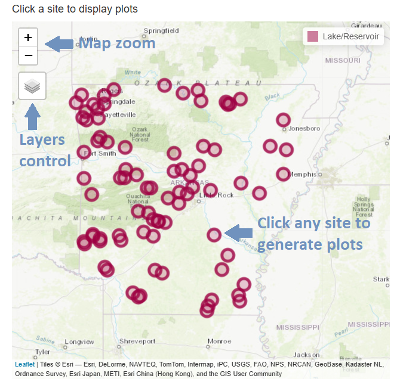
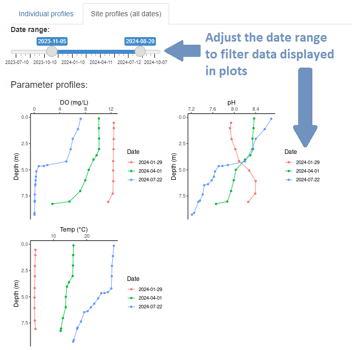

## **Introduction** 

This application is designed to interactively visualize lake profile data collected by Arkansas Division of Environmental Quality (ADEQ). 

\
Disclaimer: This app is a DRAFT modified from the original app created by Utah Division of Water Quality (DWQ).
The source code that this application was developed from and additional information for the original application are available via the [Utah DWQ Lake Profile Dashboard GitHub repository](https://github.com/utah-dwq/LakeProfileDashboard). 
\
This application is available under an [MIT license](https://github.com/utah-dwq/LakeProfileDashboard/blob/master/LICENSE).
Much of the associated text within this section is also edited from the original Utah DEQ app language.
<br> 

**Deploying the app and hosting:** 

Currently this app utilizes [shinyapps.io](https://shinyapps.io/) to host and deploy on a publicly accessible URL.
[Shiny Server](https://posit.co/products/open-source/shiny-server/) is another hosting option for those interested, and each department's IT office may have their own hosting solutions. 

Due to hosting restrictions this app can only handle limited web traffic.
If the map becomes unavailable, please contact [ADEQ's Water Quality Planning branch](https://www.adeq.state.ar.us/water/planning/) for access to lake profile data. 
<br> 

**Data** 

Data must be updated by ADEQ manually.
Data will be updated quarterly each year and will be reflective of the lake profiles collected during that time. 

The data used in this application are collected as water column profiles at lake sites throughout Arkansas.
Lake profiles consist of measurements of dissolved oxygen (mg/L), temperature (°C), and pH at regular depth intervals through the water column.
Data have been pre-processed to ensure consistency in parameter names and units.
<br> 

**Application usage** 

The application has two main inputs: a map and a table.
To build plots for any individual site, click on your desired site in either the map or the table. 

By default, only the sites with available data are shown.
The map and table inputs are responsive to each other, and thus when you click a site on the map the table will automatically filter to profile data associated with that site.
When you click on a row in the table, the map will automatically direct you to that site location. 

Plots and outputs specific to that site will be rendered automatically any time the user updates one of the input widgets.
<br> 

**Map elements** 

Individual lake monitoring locations are displayed as red circle markers on the map.
Only locations with available data will be shown.
While all lake monitoring sites are available as a map layer, not all sites will have routinely monitored vertical depth profile data.
Topographic and satellite base layers are also both available.
To turn on any of these layers, hover the mouse over the layers control box and select one or more layers (Figure 1). 

{style="display: block; margin: 1em auto;" width="503"}

```{=html}
<center> Figure 1. Map usage guide. </center>
```
<br> 

### **Outputs** 

**Individual profiles** 

The "Individual profiles" tab shows two outputs for a single profile collected at the selected site and date.
The first is a plot of dissolved oxygen (mg/L), temperature (°C), and pH against depth (m).
The second output is a scrollable table of the data from that profile used to generate the plot.
<br>

**Site profiles (all dates)** 

The "Site profiles" tab shows three outputs for a single site.
Plots of dissolved oxygen (mg/L), pH, and temperature (°C) against depth (m) are displayed across all available dates.
The date ranges used in these plots can be adjusted with the date range slider at the top of the page (Figure 2). 
 

{style="display: block; margin: 1em auto;" width="493"}

```{=html}
<center> Figure 2. Site profile date slider guide. </center>
```
<br> 

**Help & Feedback/Credit** 

Contact information for help/feedback can be found here: 

[Official Webpage for Arkansas Division of Environmental Quality - Office of Water Quality](https://www.adeq.state.ar.us/water/) 

Application modified for ADEQ use by Tanner Senti, Arkansas Division of Environmental Quality 

Original app by Jake Vander Laan, Utah Division of Water Quality 
